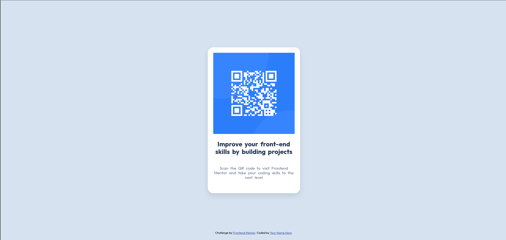
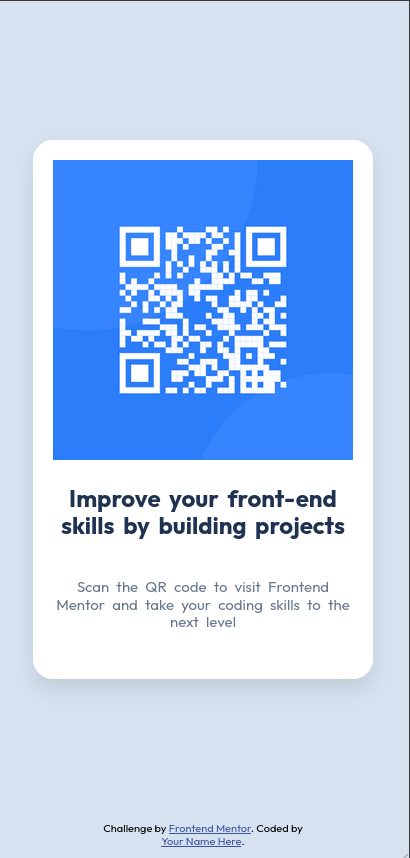

# Frontend Mentor - QR code component solution

This is a solution to the [QR code component challenge on Frontend Mentor](https://www.frontendmentor.io/challenges/qr-code-component-iux_sIO_H). Frontend Mentor challenges help you improve your coding skills by building realistic projects.

## Table of contents

- [Overview](#overview)
  - [Screenshot](#screenshot)
  - [Links](#links)
- [My process](#my-process)
  - [Built with](#built-with)
  - [What I learned](#what-i-learned)
  - [Continued development](#continued-development)
  - [Useful resources](#useful-resources)
- [Author](#author)
- [Acknowledgments](#acknowledgments)

## Overview

### Screenshot

#### Desktop



#### Mobile



### Links

- Solution URL: [Add solution URL here](https://your-solution-url.com)
- Live Site URL: [Add live site URL here](https://your-live-site-url.com)

## My process

### Built with

- Semantic HTML5 markup
- CSS custom properties
- Flexbox
- Mobile-first workflow

### What I learned

During this project, I practiced using CSS custom properties for color management, Flexbox for layout and centering, and a mobile-first workflow. I also learned how to use Google Fonts and organize CSS with normalization in a separate file.

Example of using CSS custom properties:

```css
:root {
  --white: hsl(0, 0%, 100%);
  --slate-300: hsl(212, 45%, 89%);
  --slate-500: hsl(216, 15%, 48%);
  --slate-900: hsl(218, 44%, 22%);
}
```

Example of centering content with Flexbox:

```css
body {
  display: flex;
  justify-content: center;
  align-items: center;
  min-height: 100svh;
}
```

### Continued development

In future projects, I want to continue improving my responsive design skills and explore more advanced CSS layout techniques, such as CSS Grid. I also plan to focus on accessibility and semantic HTML.

### Useful resources

- [MDN Web Docs - Flexbox](https://developer.mozilla.org/en-US/docs/Web/CSS/CSS_Flexible_Box_Layout/Basic_Concepts_of_Flexbox)
- [Google Fonts](https://fonts.google.com/)
- [Frontend Mentor](https://www.frontendmentor.io/)

## Author

- Stephen Little
- Frontend Mentor - [@stephenlit](https://www.frontendmentor.io/profile/stephenlit)

## Acknowledgments

Thanks to the Frontend Mentor community for feedback and inspiration.
